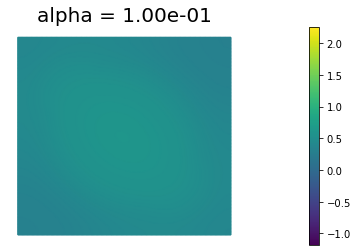
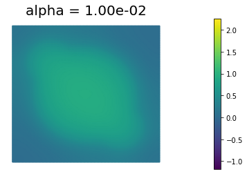
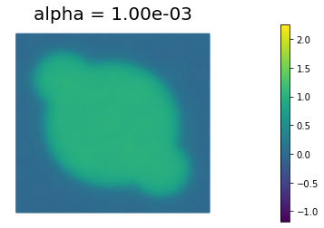
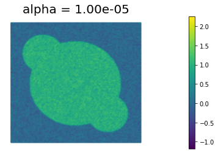

# Image Denoising: Tikhonov regularization

Given a possibly noisy image $d(\boldsymbol{x}) \in L^2(\Omega)$ defined within a
rectangular domain $\Omega \subset \mathbb{R}^2$, we would like to
find the image $m(\boldsymbol{x}) \in H^1(\Omega)$ that is closest in the $L_2(\Omega)$ sense, i.e. we
want to minimize 

$$ \mathcal{J}_{LS}(m) := \frac{1}{2}\int_\Omega (m - d)^2 \; d\boldsymbol{x}, $$

while also removing noise, which is assumed to comprise very *rough*
components of the image.

This latter goal can be incorporated as an
additional term in the objective, in the form of a penalty, called regularization.

Here we consider a Tikhonov regularization functional of the form

$$ \alpha \mathcal{R}_{TN}(m) := \! \frac{\alpha}{2}\int_\Omega \nabla m
\cdot \! \nabla m \; d\boldsymbol{x}, $$

where $\alpha$ acts as a *diffusion* coefficient that controls
how strongly we impose the penalty, i.e. how much smoothing
occurs.

Thus the denoised image $m \in H^1(\Omega)$ is the minimizer of the functional

$$ \mathcal{J}(m)  := \mathcal{J}_{LS}(m) + \alpha \mathcal{R}_{TN}(m). $$

## First order necessary optimality conditions

Let $\delta_m \mathcal{J}(m, \tilde{m})$ denote the first variation of $\mathcal{J}(m)$ in the direction $\tilde{m}$, i.e.

$$\delta_m \mathcal{J}(m, \tilde{m}) := \lim_{\varepsilon \rightarrow 0} \frac{\mathcal{J}(m + \varepsilon \tilde{m}) - \mathcal{J}(m)}{\varepsilon} = \left. \frac{d}{d \varepsilon} \mathcal{J}(m + \varepsilon \tilde{m})\right|_{\varepsilon=0}.$$

The necessary condition is that the first variation of $\mathcal{J}(m)$ equals to $0$ for all directions $\tilde{m} \in H^1(\Omega)$:

$$ \delta_m \mathcal{J} = 0 \Longleftrightarrow \frac{d}{d \varepsilon} \mathcal{J}(m + \varepsilon \tilde{m}) = 0 \quad \forall \tilde{m} \in H^1(\Omega).$$

### Variational form:

To obtain the variational form of the necessary optimality conditions we follow the steps below.

1) Expand the one dimensional function $\phi(\varepsilon) := \mathcal{J}(m + \varepsilon \tilde{m})$ as

$$\mathcal{J}(m + \varepsilon \tilde{m}) =
\frac{1}{2}\int_\Omega (m + \varepsilon \tilde{m} - d)^2 \; d\boldsymbol{x}
+ \frac{\alpha}{2}\int_\Omega \nabla (m +\varepsilon \tilde{m})\cdot \! \nabla (m +\varepsilon \tilde{m}) \; d\boldsymbol{x}.$$

2) Differentiate the one dimensional function $\phi(\varepsilon)$ with respect to $\varepsilon$

$$ \frac{d \phi}{d \varepsilon} = 
\int_\Omega \tilde{m} (m + \varepsilon \tilde{m} - d) \; d\boldsymbol{x}
+ \alpha\int_\Omega \nabla \tilde{m} \cdot \! \nabla (m +\varepsilon \tilde{m}) \; d\boldsymbol{x}.
$$

3) Evaluate $\frac{d \phi}{d \varepsilon}$ at $\varepsilon = 0$

$$ \delta_m \mathcal{J}(m, \tilde{m}) = \left. \frac{d \phi}{d \varepsilon} \right|_{\varepsilon=0} = 
\int_\Omega \tilde{m} (m - d) \; d\boldsymbol{x}
+ \alpha\int_\Omega \nabla \tilde{m} \cdot \! \nabla m \; d\boldsymbol{x}.$$

4) Set $\delta_m \mathcal{J}(m, \tilde{m}) = 0$ for all $\tilde{m} \in H^1(\Omega)$. That is find $m \in H^1(\Omega)$ such that:

$$
\int_\Omega \tilde{m} (m - d) \; d\boldsymbol{x}
+ \alpha\int_\Omega \nabla \tilde{m} \cdot \! \nabla m \; d\boldsymbol{x} = 0 \quad \forall \tilde{m} \in H^1(\Omega).
$$

### Strong form:

To obtain the strong form, we invoke Green's first identity and write

$$ \alpha\int_\Omega \nabla \tilde{m} \cdot \! \nabla m \; d\boldsymbol{x} =
-\alpha\int_\Omega \tilde{m} \nabla \cdot (\nabla m) \; d\boldsymbol{x}
+ \int_{\partial\Omega} \tilde{m} (\nabla m \cdot \boldsymbol{n}) d\boldsymbol{x}, $$

where $\boldsymbol{n}$ is the outward unit normal vector to $\partial\Omega$.

By linearity of the integral we have

$$ \int_\Omega \tilde{m} (-\alpha \nabla \cdot (\nabla m) + m - d) \; d\boldsymbol{x} 
+ \int_{\partial\Omega} \tilde{m} (\nabla m \cdot \boldsymbol{n}) d\boldsymbol{x} = 0 \quad \forall \tilde{m}.$$

Assuming that $d$ is smooth enough, by arbitrarity of $\tilde{m} \in H^1(\Omega)$, the strong form the first order optimality conditions reads

$$ 
\left\{
\begin{array}{ll}
- \nabla \cdot (\alpha \nabla m) + m = d, & {\rm in} \; \Omega;\\
(\alpha \nabla m) \cdot \boldsymbol{n} = 0, & {\rm on} \; \partial\Omega.
\end{array}
\right.
$$

The expression above corresponds to a boundary value problem with homogeneous Neumann condition 
$\nabla m \cdot \boldsymbol{n}=0$ on the boundary of $\Omega$,
which amounts to assuming that the image intensity does not change
normal to the boundary of the image. 

## 1. Python imports

We import the following libraries:

- `math`, which contains several mathematical functions
- `matplotlib, numpy, scipy`, three libraries that together allow similar functionalities to matlab
- `dolfin`, which allows us to discretize and solve variational problems using the finite element method
- `hippylib`, the extesible framework I created to solve inverse problems in Python

Finally, we import the `logging` library to silence most of the output produced by `dolfin`.


```python
import math

import matplotlib.pyplot as plt
%matplotlib inline

import numpy as np
import scipy.io as sio

import dolfin as dl

import hippylib as hp
from hippylib import nb


import logging

logging.getLogger('FFC').setLevel(logging.WARNING)
logging.getLogger('UFL').setLevel(logging.WARNING)
dl.set_log_active(False)
```

## 2. Geometry, true image, and data.

1. Read the true image from file, store the pixel values in `data`. 

2. The width of the image is `Lx = 1` and height `Ly` is set such that the aspect ratio of the image is preserved.

3. Generate a triangulation (pixelation) `mesh` of the region of interest.

4. Define the finite element space `V` of piecewise linear function on the elements of `mesh`. This represent the space of discretized images.

5. Interpolate the true image in the discrete space `V`. Call this interpolation `m_true`.

6. Corrupt the true image with i.i.d. Gaussian noise ($\sigma^2 = 0.09$) and interpolated the noisy image in the discrete space `V`. Call this interpolation `d`.

7. Visualize the true image `m_true` and the noisy image `d`.


```python
data = sio.loadmat('circles.mat')['im']

Lx = 1.
h = Lx/float(data.shape[0])
Ly = float(data.shape[1])*h
  
mesh = dl.RectangleMesh(dl.Point(0,0),dl.Point(Lx,Ly),data.shape[0], data.shape[1])
V = dl.FunctionSpace(mesh, "Lagrange",1)

trueImage = hp.NumpyScalarExpression2D()
trueImage.setData(data, h, h)
m_true  = dl.interpolate(trueImage, V)

np.random.seed(seed=1)
noise_std_dev = .3
noise = noise_std_dev*np.random.randn(data.shape[0], data.shape[1])
noisyImage = hp.NumpyScalarExpression2D()
noisyImage.setData(data+noise, h, h)
d = dl.interpolate(noisyImage, V)

# Get min/max of noisy image, so that we can show all plots in the same scale
vmin = np.min(d.vector().get_local())
vmax = np.max(d.vector().get_local())

plt.figure(figsize=(15,5))
nb.plot(m_true, subplot_loc=121, mytitle="True Image", vmin=vmin, vmax = vmax)
nb.plot(d, subplot_loc=122, mytitle="Noisy Image", vmin=vmin, vmax = vmax)
plt.show()
```


## 3. Define misfit and regurization functionals and their variations.

Here we describe the variational forms for the $L_2$ misfit functional

$$ \mathcal{J}_{LS}(m) := \frac{1}{2}\int_\Omega (m - d)^2 \; d\boldsymbol{x}, $$

and the Tikhonov regularization functional

$$ \mathcal{R}_{TN}(m) := \! \frac{1}{2}\int_\Omega \nabla m
\cdot \! \nabla m \; d\boldsymbol{x} $$

By letting $\alpha > 0$ be the amount of regularization, the Tikhonov regularized functional $\mathcal{J}$ reads  

$$ \mathcal{J}(m) = \mathcal{J}_{LS}(m) + \alpha \mathcal{R}_{TN}(m) = \frac{1}{2}\int_\Omega (m - d)^2 \; d\boldsymbol{x} + \frac{\alpha}{2}\int_\Omega \nabla m \cdot \nabla m d\boldsymbol{x}.$$

The first variation of $\mathcal{J}$ is given by

$$ \delta_m \mathcal{J}(m, \tilde{m}) = \int_\Omega \tilde{m} (m - d) \; d\boldsymbol{x}
+ \alpha\int_\Omega \nabla \tilde{m} \cdot \! \nabla m \; d\boldsymbol{x}.$$

Since we also know the true image `m_true` (*this will not be the case for real applications*),
we can also compute the true $L_2$ error functional (mean square error MSE)L

$$ {\rm MSE}(m) := \frac{1}{2}\int_\Omega (m - m_{\rm true})^2 \; d\boldsymbol{x}. $$

In the code below:

- `m = dl.Function(V)` indicates the reconstructed image
- `m_tilde = dl.TestFunction(V)` is a place holder for the arbitrary direction $\tilde{m}$
- The function `dl.solve(grad==0, m)` solves the (possibly nonlinear) system of equations to set the first variation of $\mathcal{J}$ to $0$.
- The function `dl.assemble(form)` evaluates the variational form `form`. 


```python
def TNsolution(alpha):
    m = dl.Function(V)
    m_tilde = dl.TestFunction(V)
    
    J_ls = dl.Constant(.5)*dl.inner(m - d, m - d)*dl.dx
    R_tn = dl.Constant(.5)*dl.inner(dl.grad(m), dl.grad(m))*dl.dx
    J = J_ls + dl.Constant(alpha)*R_tn
    
    grad = dl.inner(m - d, m_tilde)*dl.dx + dl.Constant(alpha)*dl.inner(dl.grad(m), dl.grad(m_tilde))*dl.dx
     
    dl.solve(grad==0, m)
    
    MSE = dl.inner(m - m_true, m - m_true)*dl.dx
    
    print( "{0:15e} {1:15e} {2:15e} {3:15e} {4:15e}".format(
           alpha, dl.assemble(J), dl.assemble(J_ls), dl.assemble(R_tn), dl.assemble(MSE)) )
    
    return m

```

## 4. Reconstruction for different values of $\alpha$.

We define some values of $\alpha$ ($\alpha = 10^{-1}, 10^{-2}, 10^{-3}, 10^{-4}, 10^{-5}$) for the choice of the regularization paramenter.

Using the MSE as measure of image quality, the best reconstruction of the original image is obtained for $\alpha = 10^{-4}$. However, we could also use Morzov discrepancy principle or the L-curve to find a good choice of $\alpha$.

By looking at the reconstructed image, we notice that the sharp edges of the true image are a bit blurred in the reconstruction. This is one of the main shortcoming of Tikhonov regularization: more advanced types of regularization (like total variation regularization) should be used to better preserve edges in the reconstructed solution.


```python
n_alphas = 5
alphas = np.power(10., -np.arange(1, n_alphas+1))

print( "{0:15} {1:15} {2:15} {3:15} {4:15}".format("alpha", "J", "J_ls", "R_tn", "MSE") )
for alpha in alphas:
    m = TNsolution(alpha)
    plt.figure()
    nb.plot(m, vmin=vmin, vmax = vmax, mytitle="alpha = {0:1.2e}".format(alpha))
    
plt.show()
```

    alpha           J               J_ls            R_tn            MSE            
       1.000000e-01    1.292136e-01    1.156620e-01    1.355154e-01    1.864769e-01
       1.000000e-02    8.101481e-02    5.787655e-02    2.313825e+00    7.109993e-02
       1.000000e-03    4.212558e-02    3.172326e-02    1.040233e+01    1.977690e-02
       1.000000e-04    2.675885e-02    2.240033e-02    4.358520e+01    6.247110e-03
       1.000000e-05    1.742607e-02    1.307915e-02    4.346922e+02    7.483126e-03














---

Copyright &copy; 2019-2020, Washington University in St. Louis.

All Rights reserved.
See file COPYRIGHT for details.

This file is part of **cmis_labs**, the teaching material for  ESE 5932 *Computational Methods for Imaging Science* at Washington University in St. Louis. Please see [https://uvilla.github.io/cmis_labs](https://uvilla.github.io/cmis_labs) for more information and source code availability.

We would like to acknowledge the Extreme Science and Engineering Discovery Environment (XSEDE), which is supported by National Science Foundation grant number ACI-1548562, for providing cloud computing resources (Jetstream) for this course through allocation TG-SEE190001.
