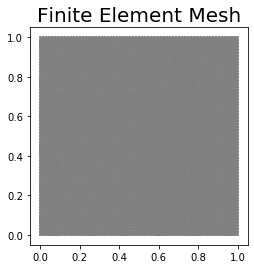
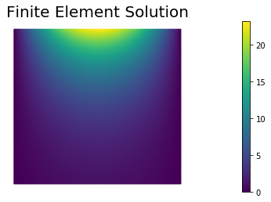

## Poisson Equation in 2D

In this example we solve the Poisson equation in two space dimensions.

For a domain $$\Omega \subset \mathbb{R}^2$$ with boundary $$\partial \Omega = \Gamma_D \cup \Gamma_N$$, we write the boundary value problem (BVP):

$$ 
\left\{
\begin{array}{ll}
- \Delta u = f  & \text{in} \; \Omega, \\
u = u_D & \text{on} \; \Gamma_D, \\
\nabla u \cdot \boldsymbol{n} = g & \text{on} \; \Gamma_N.
\end{array}
\right.$$

Here, $$\Gamma_D \subset \Omega$$ denotes the part of the boundary where we prescribe Dirichlet boundary conditions, and $$\Gamma_N \subset \Omega$$ denotes the part of the boundary where we prescribe Neumann boundary conditions. $$\boldsymbol{n}$$ denotes the unit normal of $$\partial \Omega$$ pointing outside $$\Omega$$. 

To obtain the weak form we define the functional spaces $$V_{u_D} := \left\{ u \in H^1(\Omega) \, |\, u = u_D \text{ on } \Gamma_D \right\}$$ and $$V_{0} := \left\{ u \in H^1(\Omega) \, |\, u = 0 \text{ on } \Gamma_D \right\}$$.
Then we multiply the strong form by an arbitrary function $v \in V_0$ and integrate over $$\Omega$$:

$$ - \int_\Omega \Delta u \, v \, dx = \int_\Omega f\,v \, dx, \quad \forall v \in V_0. $$

Integration by parts of the non-conforming term gives

$$ - \int_\Omega \Delta u \, v \, dx = \int_\Omega \nabla u \cdot \nabla v \, dx - \int_{\partial\Omega} (\nabla u \cdot \boldsymbol{n}) \,v\, ds $$

Recalling that $$v = 0$$ on $$\Gamma_D$$ and that $$\nabla u \cdot \boldsymbol{n} = g$$ on $$\Gamma_N$$, the weak form of the BVP is the following.

Find $$u \in V_{u_D}$$:

$$ \int_\Omega \nabla u \cdot \nabla v \, dx = \int_\Omega f\,v \, dx + \int_{\Gamma_N} g\,v\,ds, \quad \forall v \in V_0. $$

To obtain the finite element discretization we then introduce a triangulation (mesh) $\mathcal{T}_h$ of the domain $\Omega$ and we define a finite dimensional subspace $V_h \subset H^1(\Omega)$ consisting of globally continuous functions that are piecewise polynomial on each element of $\mathcal{T}_h$.

By letting $$V_{h, u_D} := \{ v_h \in V_h \,|\, v_h = u_D \text{ on } \Gamma_D\}$ and $V_{h, 0} := \{ v_h \in V_h \,|\, v_h = 0 \text{ on } \Gamma_D\}$$, the finite element method then reads:

Find $$u_h \in V_{h, u_D}$$ such that:

$$ \int_\Omega \nabla u_h \cdot \nabla v_h \, dx = \int_\Omega f\,v_h \, dx + \int_{\Gamma_N} g\,v_h\,ds, \quad \forall v_h \in V_{h,0}. $$

In what follow, we will let $$\Omega := [0,1]\times[0,1]$$ be the unit square, $$\Gamma_N := \{ (x,y) \in \partial\Omega \,|\, y = 1\}$$ be the top boundary, and $$\Gamma_D := \partial\Omega \setminus \Gamma_N$$ be the union of the left, bottom, and right boundaries.

The coefficient $$f$$, $$g$$, $$u_D$$ are chosen such that the analytical solution is $$u_{ex} = e^{\pi y} \sin(\pi x)$$.


### 1. Imports
We import the following Python packages:

- `dolfin` is the python interface to FEniCS.
- `matplotlib` is a plotting library that produces figure similar to the Matlab ones.
- `math` is the python built-in library of mathematical functions.


```python
# Import FEniCS
import dolfin as dl
import math

# Enable plotting inside the notebook
import matplotlib.pyplot as plt
%matplotlib inline

from hippylib import nb

import logging
logging.getLogger('FFC').setLevel(logging.WARNING)
logging.getLogger('UFL').setLevel(logging.WARNING)
dl.set_log_active(False)
```

### 2. Define the mesh and the finite element space
We define a triangulation (mesh) of the unit square $$\Omega = [0,1]\times[0,1]$$ with `n` elements in each direction. The mesh size $$h$$ is $$\frac{1}{n}$$.

We also define the finite element space $$V_h$$ as the space of globally continuos functions that are piecewise polinomial (of degree $$d$$) on the elements of the mesh.


```python
n = 64
d = 1
mesh = dl.UnitSquareMesh(n, n)
Vh = dl.FunctionSpace(mesh, "Lagrange", d)
print("Number of dofs", Vh.dim())
nb.plot(mesh, mytitle="Finite Element Mesh", show_axis='on')
plt.show()
```

    Number of dofs 4225





### 3. Define the Dirichlet boundary condition

We define the Dirichlet boundary condition $$u = u_d := \sin(\pi x)$$ on $$\Gamma_D$$.


```python
def boundary_d(x, on_boundary):
    return (x[1] < dl.DOLFIN_EPS or x[0] < dl.DOLFIN_EPS or x[0] > 1.0 - dl.DOLFIN_EPS) and on_boundary

u_d  = dl.Expression("sin(DOLFIN_PI*x[0])", degree = d+2)
bcs = [dl.DirichletBC(Vh, u_d, boundary_d)]
```

### 4. Define the variational problem

We write the variational problem $$a(u_h, v_h) = F(v_h)$$. Here, the bilinear form $$a$$ and the linear form $$L$$ are defined as

- $$a(u_h, v_h) := \int_\Omega \nabla u_h \cdot \nabla v_h \, dx$$
- $$L(v_h) := \int_\Omega f v_h \, dx + \int_{\Gamma_N} g \, v_h \, dx$$.

$$u_h$$ denotes the trial function and $$v_h$$ denotes the test function.  The coefficients $$f = 0$$ and $$g = \pi\, e^{\pi y} \sin( \pi x) $$ are also given.


```python
uh = dl.TrialFunction(Vh)
vh = dl.TestFunction(Vh)

f = dl.Constant(0.)
g = dl.Expression("DOLFIN_PI*exp(DOLFIN_PI*x[1])*sin(DOLFIN_PI*x[0])", degree=d+2)
a = dl.inner(dl.grad(uh), dl.grad(vh))*dl.dx
L = f*vh*dl.dx + g*vh*dl.ds
```

### 5. Assemble and solve the finite element discrete problem

We now assemble the finite element stiffness matrix $A$ and the right hand side vector $$b$$. Dirichlet boundary conditions are applied at the end of the finite element assembly procedure and before solving the resulting linear system of equations.


```python
A, b = dl.assemble_system(a, L, bcs)
uh = dl.Function(Vh)
dl.solve(A, uh.vector(), b)

nb.plot(uh, mytitle="Finite Element Solution")
plt.show()
```





### 6. Compute error norms

We then compute the $$L^2(\Omega)$$ and the energy norm of the difference between the exact solution and the finite element approximation.


```python
u_ex = dl.Expression("exp(DOLFIN_PI*x[1])*sin(DOLFIN_PI*x[0])", degree = d+2, domain=mesh)
grad_u_ex = dl.Expression( ("DOLFIN_PI*exp(DOLFIN_PI*x[1])*cos(DOLFIN_PI*x[0])",
                         "DOLFIN_PI*exp(DOLFIN_PI*x[1])*sin(DOLFIN_PI*x[0])"), degree = d+2, domain=mesh )

norm_u_ex   = math.sqrt(dl.assemble(u_ex**2*dl.dx))
norm_grad_ex = math.sqrt(dl.assemble(dl.inner(grad_u_ex, grad_u_ex)*dl.dx))

err_L2   = math.sqrt(dl.assemble((uh - u_ex)**2*dl.dx))
err_grad = math.sqrt(dl.assemble(dl.inner(dl.grad(uh) - grad_u_ex, dl.grad(uh) - grad_u_ex)*dl.dx))

print ("|| u_ex - u_h ||_L2 / || u_ex ||_L2 = ", err_L2/norm_u_ex)
print ("|| grad(u_ex - u_h)||_L2 / = || grad(u_ex)||_L2 ", err_grad/norm_grad_ex)
```

    || u_ex - u_h ||_L2 / || u_ex ||_L2 =  0.00042675397744578077
    || grad(u_ex - u_h)||_L2 / = || grad(u_ex)||_L2  0.02453704048509311


---

Copyright &copy; 2019-2020, Washington University in St. Louis.

All Rights reserved.
See file COPYRIGHT for details.

This file is part of **cmis_labs**, the teaching material for  ESE 5932 *Computational Methods for Imaging Science* at Washington University in St. Louis. Please see [https://uvilla.github.io/cmis_labs](https://uvilla.github.io/cmis_labs) for more information and source code availability.

We would like to acknowledge the Extreme Science and Engineering Discovery Environment (XSEDE), which is supported by National Science Foundation grant number ACI-1548562, for providing cloud computing resources (Jetstream) for this course through allocation TG-SEE190001.
