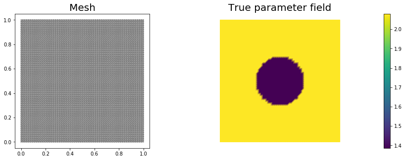
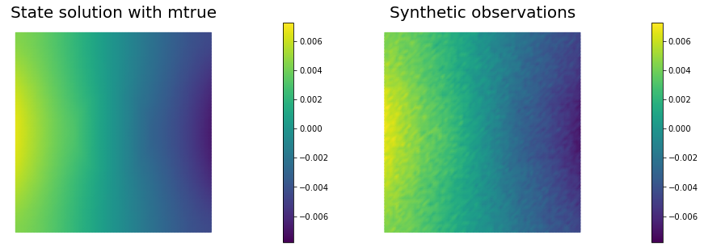
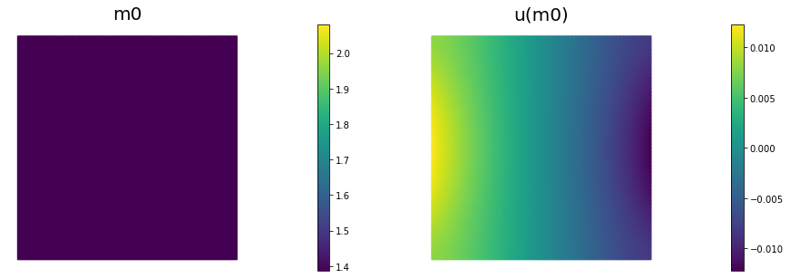
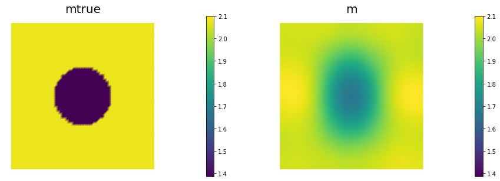
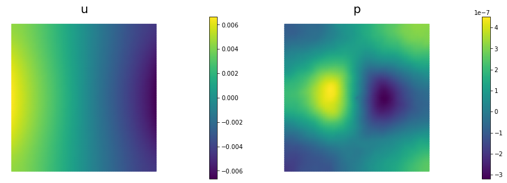
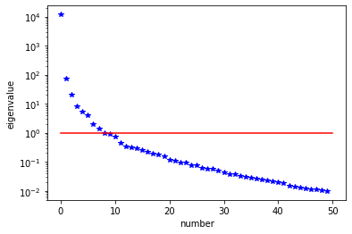
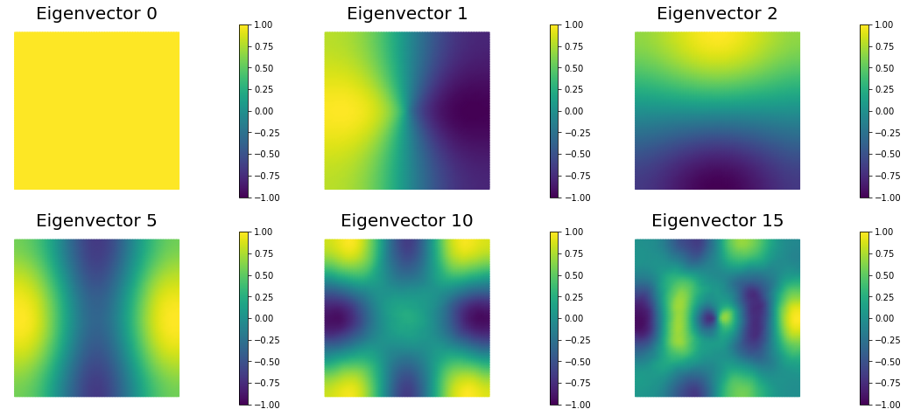

# Coefficient field inversion in an elliptic partial differential equation

We consider the estimation of a coefficient in an elliptic partial
differential equation as a model problem. Depending on the interpretation of the unknowns and the type of measurements, this model problem arises, for instance, in electrical impedence tomography.

Let $$\Omega\subset\mathbb{R}^n$$, $$n\in\{1,2,3\}$$ be an open, bounded
domain and consider the following problem:

$$
\min_{m} J(m):=\frac{1}{2}\int_\Omega (u-d)^2\, dx + \frac{\gamma}{2}\int_\Omega |\nabla m|^2\,dx,
$$

where $$u$$ is the solution of

$$
\begin{split}
\quad -\nabla\cdot(e^m\nabla u) &= f \text{ in }\Omega,\\
e^m \nabla u &= j \text{ on }\partial\Omega.
\end{split}
$$

Here $$m\in \mathcal{M}:=\{m\in H^1(\Omega) \bigcap L^{\infty}(\Omega)\}$$ denotes the unknown coefficient field, $$u \in \mathcal{V}:= \left\{v \in H^1(\Omega) | v(\boldsymbol{x}_c) = 0 \text{ for a given point } \boldsymbol{x}_c\in \Omega \right\}$$ the state variable, $$d$$ the (possibly noisy) data, $$j\in H^{-1/2}(\partial\Omega)$$ a given boundary force, and $$\gamma\ge 0$$ the regularization parameter.

### The variational (or weak) form of the state equation:

Find $$u\in \mathcal{V}$$ such that 

$$ \int_{\Omega}e^m \nabla u \cdot \nabla \tilde{p} \, dx - \int_{\partial \Omega} j \tilde{p} \,dx = 0, \text{ for all } \tilde{p} \in \mathcal{V}.$$

### Gradient evaluation:

The Lagrangian functional $$\mathscr{L}: \mathcal{V} \times \mathcal{M} \times \mathcal{V} \rightarrow \mathbb{R}$$ is given by

$$
\mathscr{L}(u,m,p):= \frac{1}{2}\int_{\Omega}(u-u_d)^2 dx +
\frac{\gamma}{2}\int_\Omega \nabla m \cdot \nabla m dx +  \int_{\Omega} e^m\nabla u \cdot \nabla p dx 
- \int_{\partial \Omega} j\,p\, dx.
$$

Then the gradient of the cost functional $$\mathcal{J}(m)$$ with respect to the parameter $$m$$ is

$$
    (\mathcal{G}(m), \tilde m) := (\mathscr{L}_m(u,m,p),\tilde{m}) = \gamma \int_\Omega \nabla m \cdot \nabla \tilde{m}\, dx +
     \int_\Omega \tilde{m}e^m\nabla u \cdot \nabla p\, dx \quad \forall \tilde{m} \in \mathcal{M},
$$

where $$u \in \mathcal{V}$$ is the solution of the forward problem,

$$ (\mathscr{L}_p(u,m,p), \tilde{p})  := \int_{\Omega}e^m\nabla u \cdot \nabla \tilde{p}\, dx - \int_{\partial\Omega} j\,\tilde{p}\, dx = 0
\quad \forall \tilde{p} \in \mathcal{V}, $$

and $$p \in \mathcal{V}$$ is the solution of the adjoint problem,

$$ (\mathscr{L}_u(u,m,p), \tilde{u}) := \int_{\Omega} e^m\nabla p \cdot \nabla \tilde{u}\, dx + \int_{\Omega} (u-d)\tilde{u}\,dx = 0
\quad \forall \tilde{u} \in \mathcal{V}.$$

### Hessian action:

To evaluate the action $$\mathcal{H}(m)(\hat{m})$$ of the Hessian is a given direction $$\hat{m}$$ , we consider variations of the meta-Lagrangian functional

$$
\begin{aligned}
\mathscr{L}^H(u,m,p; \hat{u}, \hat{m}, \hat{p}) := & {} & {} \\
{} & \gamma\int_\Omega \nabla m\cdot \nabla \hat{m}\, dx + \int_\Omega\hat{m}e^m\nabla u \cdot \nabla p\, dx & \text{gradient}\\
{} & + \int_\Omega e^m\nabla u \cdot \nabla \hat{p}\,dx - \int_{\partial\Omega} j\, \hat{p}\, dx & \text{forward eq}\\
{} & +  \int_\Omega e^m\nabla p \cdot \nabla \hat{u}\,dx + \int_\Omega (u-u_d)\,\hat{u}\, dx & \text{adjoint eq}.
\end{aligned}
$$

Then action of the Hessian is a given direction $$\hat{m}$$ is

$$
\begin{aligned}
(\tilde{m}, \mathcal{H}(m)(\hat{m}) ) & := \left(\mathscr{L}^H_m(u,m,p; \hat{u}, \hat{m}, \hat{p}), \tilde{m}\right) \\
{} & =
\int_\Omega \tilde{m} e^m \nabla \hat{u} \cdot \nabla{p}\, dx + \gamma \int_\Omega \nabla \hat{m} \cdot \nabla \tilde{m}\,dx + \int_\Omega \tilde{m} \hat{m} e^m \nabla u\cdot \nabla p\,dx + \int_\Omega \tilde{m} e^m \nabla u\cdot \nabla \hat{p}\, dx \quad \forall \tilde{m} \in \mathcal{M},
\end{aligned}
$$

where 

- $$u\in \mathcal{V}$$ and $$p \in \mathcal{V}$$ are the solution of the forward and adjoint problem, respectively;

- $$\hat{u} \in \mathcal{V}$$ is the solution of the incremental forward problem,

$$
\left( \mathscr{L}^H_p(u,m,p; \hat{u}, \hat{m}, \hat{p}), \tilde{p}\right) := \int_\Omega e^m \nabla \hat{u} \cdot \nabla \tilde{p} \, dx + \int_\Omega \hat{m} e^m \, \nabla u \cdot \nabla \tilde p\, dx = 0 \quad \forall \tilde{p} \in \mathcal{V};
$$


- and $$\hat{p} \in \mathcal{V}$$ is the solution of the incremental adjoint problem,
$$
\left( \mathscr{L}^H_u(u,m,p; \hat{u}, \hat{m}, \hat{p}), \tilde{u}\right) := \int_\Omega \hat{u} \tilde{u}\,dx + \int_\Omega \hat{m} e^m\nabla p \cdot \nabla \tilde{u}\,dx + \int_\Omega e^m \nabla \tilde u \cdot \nabla \hat{p}\,dx = 0 \quad \forall \tilde{u} \in \mathcal{V}.
$$

### Inexact Newton-CG:

Written in abstract form, the Newton Method computes an update direction $$\hat{m}_k$$ by solving the linear system 

$$
\left(\tilde{m}, \mathcal{H}(m_k)(\hat{m}_k) \right) = -\left(\tilde{m}, \mathcal{G}(m_k)\right) \quad \forall \tilde{m} \in \mathcal{M},
$$

where the evaluation of the gradient $$\mathcal{G}(m_k)$$ involve the solution $$u_k$$ and $$p_k$$ of the forward and adjoint problem (respectively) for $$m = m_k$$.
Similarly, the Hessian action $$\mathcal{H}(m_k)(\hat{m}_k)$$ requires to additional solve the incremental forward and adjoint problems.

### Discrete Newton system:
$$
\def\tu{\tilde u}
\def\tm{\tilde m}
\def\tp{\tilde p}
\def\hu{\hat u}
\def\hp{\hat p}
\def\hm{\hat m}
$$
$$
\def\bu{{\bf u}}
\def\bm{{\bf m}}
\def\bp{{\bf p}}
\def\btu{{\bf \tilde u}}
\def\btm{{\bf \tilde m}}
\def\btp{{\bf \tilde p}}
\def\bhu{{\bf \hat u}}
\def\bhm{{\bf \hat m}}
\def\bhp{{\bf \hat p}}
\def\bg{{\bf g}}
$$
$$
\def\bA{{\bf A}}
\def\bC{{\bf C}}
\def\bH{{\bf H}}
\def\bR{{\bf R}}
\def\bW{{\bf W}}
$$

Let us denote the vectors corresponding to the discretization of the functions $$u_k, m_k, p_k$$ by $$\bu_k, \bm_k, \bp_k$$ and of the functions $$\hu_k, \hm_k, \hp_k$$ by $$\bhu_k, \bhm_k,\bhp_k$$.

Then, the discretization of the above system is given by the following symmetric linear system:

$$
  \bH_k \, \bhm_k = -\bg_k.
$$

The gradient $$\bg_k$$ is computed using the following three steps

- Given $$\bm_k$$ we solve the forward problem

$$ \bA_k \bu_k = {\bf f}, $$

where $$\bA_k \bu_k$$ stems from the discretization $$(e^{m_k}\nabla u_k, \nabla \tilde{p})$$, and $${\bf f}$$ stands for the discretization of the right hand side $$j$$.

- Given $$\bm_k$$ and $$\bu_k$$ solve the adjoint problem

$$ \bA_k^T \bp_k = - \bW_{\scriptsize\mbox{uu}}\,(\bu_k-\bu_d) $$

where $$\bA_k^T \bp_k$$ stems from the discretization of $$(e^{m_k}\nabla \tilde{u}, \nabla p_k)$$, $$\bW_{\scriptsize\mbox{uu}}$$ is the mass matrix corresponding to the $$L^2$$ inner product in the state space, and $$\bu_d$$ stems from the data.

- Define the gradient 

$$ \bg_k = \bR \bm_k + \bC_k^T \bp_k, $$

where $$\bR$$ is the matrix stemming from discretization of the regularization operator $$\gamma ( \nabla \hat{m}, \nabla \tilde{m})$$, and $$\bC_k$$ stems from discretization of the term $$(\tilde{m} e^{m_k} \, \nabla u_k, \nabla p_k)$$.

Similarly the action of the Hessian $$\bH_k \, \bhm_k$$ in a direction $$\bhm_k$$ (by using the CG algorithm we only need the action of $$\bH_k$$ to solve the Newton step) is given by

- Solve the incremental forward problem

$$ \bA_k \bhu_k = -\bC_k \bhm_k, $$

where $$\bC_k \bm_k$$ stems from discretization of $$(\hat{m} e^{m_k} \nabla u_k, \nabla \tilde p)$$.

- Solve the incremental adjoint problem

$$ \bA_k^T \bhp_k = -(\bW_{\scriptsize\mbox{uu}} \bhu_k + \bW_{\scriptsize\mbox{um}}\,\bhm_k),$$

where $$\bW_{\scriptsize\mbox{um}}\,\bhm_k$$ stems for the discretization of $$(\hat{m}_k e^{m_k}\nabla p_k, \nabla \tilde{u})$$.

- Define the Hessian action

$$
  \bH_k \, \bhm = \underbrace{\bR}_{\text{Hessian of the regularization}} \bhm +
    \underbrace{(\bW_{\scriptsize\mbox{mm}}+ \bC_k^{T}\bA_k^{-T} (\bW_{\scriptsize\mbox{uu}}
    \bA_k^{-1} \bC_k - \bW_{\scriptsize\mbox{um}}) -
    \bW_{\scriptsize\mbox{mu}} \bA_k^{-1}
    \bC_k)}_{\text{Hessian of the data misfit}}\;\bhm.
$$

### Goals:

By the end of this notebook, you should be able to:

- solve the forward and adjoint Poisson equations
- understand the inverse method framework
- visualise and understand the results
- modify the problem and code

### Mathematical tools used:

- Finite element method
- Derivation of gradiant and Hessian via the adjoint method
- inexact Newton-CG
- Armijo line search

### 1. Import dependencies


```python
import dolfin as dl
import numpy as np

from hippylib import *

import logging

import matplotlib.pyplot as plt
%matplotlib inline

logging.getLogger('FFC').setLevel(logging.WARNING)
logging.getLogger('UFL').setLevel(logging.WARNING)
dl.set_log_active(False)
```

### 2. Model set up:

As in the introduction, the first thing we need to do is set up the numerical model.  In this cell, we set the mesh, the finite element functions $$u, m, p$$ corresponding to state, parameter and adjoint variables, and the corresponding test functions and the parameters for the optimization.

The true parameter ``mtrue`` is the finite element interpolant of the function

$$ m_{\rm true} = \left\{ \begin{array}{l} \ln 4 \; \forall \,(x,y) \, {\rm s.t.}\, \sqrt{ (x-.5)^2 + (y-.5)^2} \leq 0.2 \\ \ln 8 \; {\rm otherwise}. \end{array}\right. $$

The forcing term ``j``  for the forward problem is

$$ j(x,y) = (x - 0.5)y(y-1) \; \forall {\boldsymbol{x}=(x,y)} \in \partial\Omega. $$


```python
# create mesh and define function spaces
nx = 64
ny = 64
mesh = dl.UnitSquareMesh(nx, ny)
Vm = dl.FunctionSpace(mesh, 'Lagrange', 1)
Vu = dl.FunctionSpace(mesh, 'Lagrange', 2)

# The true and initial guess inverted parameter
mtrue_str = 'std::log( 8. - 4.*(pow(x[0] - 0.5,2) + pow(x[1] - 0.5,2) < pow(0.2,2) ) )'
mtrue = dl.interpolate(dl.Expression(mtrue_str, degree=5), Vm)

# define function for state and adjoint
u = dl.Function(Vu)
m = dl.Function(Vm)
p = dl.Function(Vu)

# define Trial and Test Functions
u_trial, m_trial, p_trial = dl.TrialFunction(Vu), dl.TrialFunction(Vm), dl.TrialFunction(Vu)
u_test,  m_test,  p_test  = dl.TestFunction(Vu),  dl.TestFunction(Vm),  dl.TestFunction(Vu)

# initialize input functions
j  = dl.Expression("(x[0]-.5)*x[1]*(x[1]-1)", degree=3)

# plot
plt.figure(figsize=(15,5))
nb.plot(mesh,subplot_loc=121, mytitle="Mesh", show_axis='on')
nb.plot(mtrue,subplot_loc=122, mytitle="True parameter field")
plt.show()
```





```python
# Fix the value of the state at the center of the domain
def d_boundary(x,on_boundary):
    return dl.near(x[0], .5) and dl.near(x[1], .5)

u0 = dl.Constant(0.)
bc_state = dl.DirichletBC(Vu, u0, d_boundary, "pointwise")
bc_adj   = dl.DirichletBC(Vu, dl.Constant(0.), d_boundary, "pointwise")
```

### 3. Set up synthetic observations  (inverse crime):

- Propose a coefficient field $$m_{\rm true}$$ shown above
- The variational form of the PDE:

Find $$u\in \mathcal{V}$$ such that 

$$\underbrace{\int_\Omega e^{m_{\text true}} \nabla u \cdot \nabla v \, dx}_{\; := \; a_{\rm true}} - \underbrace{\int_{\partial\Omega} j\,v\,dx}_{\; := \;L_{\rm true}} = 0, \text{ for all } v\in \mathcal{V}$$.

- Perturb the solution: $$u = u + \eta$$, where $$\eta \sim \mathcal{N}(0, \sigma^2)$$


```python
# noise level
noise_level = 0.05

# weak form for setting up the synthetic observations
a_true = dl.inner(dl.exp(mtrue) * dl.grad(u_trial), dl.grad(u_test)) * dl.dx
L_true = dl.inner(j, u_test) * dl.ds

# solve the forward/state problem to generate synthetic observations
A_true, b_true = dl.assemble_system(a_true, L_true, bc_state)

utrue = dl.Function(Vu)
dl.solve(A_true, utrue.vector(), b_true)

d = dl.Function(Vu)
d.assign(utrue)

# perturb state solution and create synthetic measurements d
# d = u + ||u||/SNR * random.normal
MAX = d.vector().norm("linf")
noise = dl.Vector()
A_true.init_vector(noise,1)
noise.set_local( noise_level * MAX * np.random.normal(0, 1, len(d.vector().get_local())) )
bc_adj.apply(noise)

d.vector().axpy(1., noise)

# plot
nb.multi1_plot([utrue, d], ["State solution with mtrue", "Synthetic observations"])
plt.show()
```





### 4. The cost function evaluation:

$$
J(m):=\underbrace{\frac{1}{2}\int_\Omega (u-d)^2\, dx}_{\text{misfit} } + \underbrace{\frac{\gamma}{2}\int_\Omega|\nabla m|^2\,dx}_{\text{reg}}
$$


```python
# regularization parameter
gamma = 1e-8

# define cost function
def cost(u, d, m,gamma):
    reg = 0.5*gamma * dl.assemble( dl.inner(dl.grad(m), dl.grad(m))*dl.dx ) 
    misfit = 0.5 * dl.assemble( (u-d)**2*dl.dx)
    return [reg + misfit, misfit, reg]
```

### 5. Setting up the variational form for the state/adjoint equations and gradient evaluation

Below we define the variational forms that appears in the the state/adjoint equations and gradient evaluations.

Specifically,

- `a_state`, `L_state` stand for the bilinear and linear form of the state equation, repectively;
- `a_adj`, `L_adj` stand for the bilinear and linear form of the adjoint equation, repectively;
- `grad_misfit`, `grad_reg` stand for the contributions to the gradient coming from the PDE and the regularization, respectively.

We also build the *mass* matrix $$M$$ that is used to discretize the $$L^2(\Omega)$$ inner product.


```python
# weak form for setting up the state equation
a_state = dl.inner(dl.exp(m) * dl.grad(u_trial), dl.grad(u_test)) * dl.dx
L_state = dl.inner(j, u_test) * dl.ds

# weak form for setting up the adjoint equation
a_adj = dl.inner(dl.exp(m) * dl.grad(p_trial), dl.grad(p_test)) * dl.dx
L_adj = -dl.inner(u - d, p_test) * dl.dx

# weak form for gradient
grad_misfit    = dl.inner(dl.exp(m)*m_test*dl.grad(u), dl.grad(p)) * dl.dx
grad_reg = gamma*dl.inner(dl.grad(m), dl.grad(m_test))*dl.dx

# L^2 weighted inner product
M_varf   = dl.inner(m_trial, m_test) * dl.dx
M = dl.assemble(M_varf)
```

### 6. Initial guess
We solve the state equation and compute the cost functional for the initial guess of the parameter ``m0``


```python
m0 = dl.interpolate(dl.Constant(np.log(4.) ), Vm )

m.assign(m0)

# solve state equation
state_A, state_b = dl.assemble_system (a_state, L_state, bc_state)
dl.solve (state_A, u.vector(), state_b)

# evaluate cost
[cost_old, misfit_old, reg_old] = cost(u, d, m, gamma)

# plot
plt.figure(figsize=(15,5))
nb.plot(m,subplot_loc=121, mytitle="m0", vmin=mtrue.vector().min(), vmax=mtrue.vector().max())
nb.plot(u,subplot_loc=122, mytitle="u(m0)")
plt.show()
```





### 7. Variational forms for Hessian action

We define the following variational forms that are needed for the Hessian evaluation

- `W_varf`, `R_varf` are the second variation of the data-misfit and regularization component of the cost functional respectively (note since `W_varf`, `R_varf` are independent of $$u$$, $$m$$, $$p$$ they can be preassembled);

- `C_varf` is the second variation of the PDE with respect to $$p$$ and $$m$$;

- `Wum_varf` is the second variation of the PDE with respect to $$u$$ and $$m$$;

- `Wmm_varf` is the second variation of the PDE with respect to $$m$$.

> **Note**: Since the forward problem is linear, the bilinear forms for the incremental state and adjoint equations are the same as the bilinear forms for the state and adjoint equations, respectively.


```python
W_varf   = dl.inner(u_trial, u_test) * dl.dx
R_varf   = dl.Constant(gamma) * dl.inner(dl.grad(m_trial), dl.grad(m_test)) * dl.dx

C_varf   = dl.inner(dl.exp(m) * m_trial * dl.grad(u), dl.grad(u_test)) * dl.dx
Wum_varf = dl.inner(dl.exp(m) * m_trial * dl.grad(p_test), dl.grad(p)) * dl.dx
Wmm_varf = dl.inner(dl.exp(m) * m_trial * m_test *  dl.grad(u),  dl.grad(p)) * dl.dx

# Assemble constant matrices
W = dl.assemble(W_varf)
R = dl.assemble(R_varf)
```

### 8. Hessian action on a vector $$\bhm$$:

Here we describe how to apply the Hessian operator to a vector $$\bhm$$. For an opportune choice of the regularization, the Hessian operator evaluated in a neighborhood of the solution is positive define, whereas far from the solution the reduced Hessian may be indefinite. On the constrary, the Gauss-Newton approximation of the Hessian is always positive defined.

For this reason, it is beneficial to perform a few initial Gauss-Newton steps (5 in this particular example) to accelerate the convergence of the inexact Newton-CG algorithm.

The Hessian action reads:
$$
\begin{align}
\bhu &= -\bA^{-1} \bC \bhm\, & \text{incremental forward}\\
\bhp &= -\bA^{-T} (\bW_{\scriptsize\mbox{uu}} \bhu +
\bW_{\scriptsize\mbox{um}}\,\bhm) & \text{incremental adjoint}\\
\bH \bhm &= (\bR + \bW_{\scriptsize\mbox{mm}})\bhm + \bC^T \bhp + \bW_{\scriptsize\mbox{mu}} \bhu.
\end{align}
$$

The Gauss-Newton Hessian action is obtained by dropping the second derivatives operators $$\bW_{\scriptsize\mbox{um}}\,\bhm$$, $$\bW_{\scriptsize\mbox{mm}}\bf \bhm$$, and $$\bW_{\scriptsize\mbox{mu}} \bhu$$:
$$
\begin{align}
\bhu &= -\bA^{-1} \bC \bf \bhm\, & \text{incremental forward}\\
\bhp &= -\bA^{-T} \bW_{\scriptsize\mbox{uu}} \bhu & \text{incremental adjoint}\\
\bH_{\rm GN} \bhm &= \bR \bhm + \bC^T \bhp.
\end{align}
$$


```python
# Class HessianOperator to perform Hessian apply to a vector
class HessianOperator():
    cgiter = 0
    def __init__(self, R, Wmm, C, A, adj_A, W, Wum, bc0, use_gaussnewton=False):
        self.R = R
        self.Wmm = Wmm
        self.C = C
        self.A = A
        self.adj_A = adj_A
        self.W = W
        self.Wum = Wum
        self.bc0 = bc0
        self.use_gaussnewton = use_gaussnewton
        
        # incremental state
        self.du = dl.Vector()
        self.A.init_vector(self.du,0)
        
        #incremental adjoint
        self.dp = dl.Vector()
        self.adj_A.init_vector(self.dp,0)
        
        # auxiliary vector
        self.Wum_du = dl.Vector()
        self.Wum.init_vector(self.Wum_du, 1)
        
    def init_vector(self, v, dim):
        self.R.init_vector(v,dim)

    # Hessian performed on v, output as generic vector y
    def mult(self, v, y):
        self.cgiter += 1
        y.zero()
        if self.use_gaussnewton:
            self.mult_GaussNewton(v,y)
        else:
            self.mult_Newton(v,y)
            
    # define (Gauss-Newton) Hessian apply H * v
    def mult_GaussNewton(self, v, y):
        
        #incremental forward
        rhs = -(self.C * v)
        self.bc0.apply(rhs)
        dl.solve (self.A, self.du, rhs)
        
        #incremental adjoint
        rhs = - (self.W * self.du)
        self.bc0.apply(rhs)
        dl.solve (self.adj_A, self.dp, rhs)
                
        # Misfit term
        self.C.transpmult(self.dp, y)
        
        if self.R:
            Rv = self.R*v
            y.axpy(1, Rv)
        
    # define (Newton) Hessian apply H * v
    def mult_Newton(self, v, y):
        
        #incremental forward
        rhs = -(self.C * v)
        self.bc0.apply(rhs)
        dl.solve (self.A, self.du, rhs)
        
        #incremental adjoint
        rhs = -(self.W * self.du) -  self.Wum * v
        self.bc0.apply(rhs)
        dl.solve (self.adj_A, self.dp, rhs)
                
        #Misfit term
        self.C.transpmult(self.dp, y)
        
        self.Wum.transpmult(self.du, self.Wum_du)
        y.axpy(1., self.Wum_du)
        
        y.axpy(1., self.Wmm*v)
        
        #Reg/Prior term
        if self.R:
            y.axpy(1., self.R*v)
        
```

### 9. The inexact Newton-CG optimization with Armijo line search:

We solve the constrained optimization problem using the inexact Newton-CG method with Armijo line search.

The stopping criterion is based on a relative reduction of the norm of the gradient (i.e. $$\frac{\|g_{n}\|}{\|g_{0}\|} \leq \tau$$).

First, we compute the gradient by solving the state and adjoint equation for the current parameter $$m$$, and then substituing the current state $$u$$, parameter $$m$$ and adjoint $$p$$ variables in the weak form expression of the gradient:
$$ (\mathcal{G}(m), \tilde{m}) = \gamma\int_\Omega \nabla m \cdot \nabla \tilde{m} dx +\int_\Omega \tilde{m}\nabla u \cdot \nabla p\, dx.$$

Then, we compute the Newton direction $$\hat m$$ by iteratively solving $$\mathcal{H} {\hat m} = -\mathcal{G}$$.
The Newton system is solved inexactly by early termination of conjugate gradient iterations via Eisenstat–Walker (to prevent oversolving) and Steihaug  (to avoid negative curvature) criteria. 

> Usually, one uses the regularization matrix $$R$$ as preconditioner for the Hessian system, however since $$R$$ is singular (the constant vector is in the null space of $$R$$), here we use $$P = R + \frac{\gamma}{10} M$$, where $$M$$ is the mass matrix in parameter space.

Finally, the Armijo line search uses backtracking to find $$\alpha$$ such that a sufficient reduction in the cost functional is achieved.
More specifically, we use backtracking to find $$\alpha$$ such that:
$$J( m + \alpha \hat m ) \leq J(m) + \alpha c_{\rm armijo} (\hat m,g). $$


```python
# define parameters for the optimization
tol = 1e-8
c = 1e-4
maxiter = 12
plot_on = False

# initialize iter counters
iter = 1
total_cg_iter = 0
converged = False

# initializations
g, m_delta = dl.Vector(), dl.Vector()
R.init_vector(m_delta,0)
R.init_vector(g,0)

m_prev = dl.Function(Vm)

print( "Nit   CGit   cost          misfit        reg           sqrt(-G*D)    ||grad||       alpha  tolcg" )

while iter <  maxiter and not converged:

    # solve the adoint problem
    adjoint_A, adjoint_RHS = dl.assemble_system(a_adj, L_adj, bc_adj)
    dl.solve(adjoint_A, p.vector(), adjoint_RHS)

    # evaluate the  gradient
    MG = dl.assemble(grad_misfit + grad_reg)

    # calculate the L^2 norm of the gradient
    dl.solve(M, g, MG)
    grad2 = g.inner(MG)
    gradnorm = np.sqrt(grad2)

    # set the CG tolerance (use Eisenstat–Walker termination criterion)
    if iter == 1:
        gradnorm_ini = gradnorm
    tolcg = min(0.5, np.sqrt(gradnorm/gradnorm_ini))
    
    # assemble W_um and W_mm
    C   = dl.assemble(C_varf)
    Wum = dl.assemble(Wum_varf)
    Wmm = dl.assemble(Wmm_varf)

    # define the Hessian apply operator (with preconditioner)
    Hess_Apply = HessianOperator(R, Wmm, C, state_A, adjoint_A, W, Wum, bc_adj, use_gaussnewton=(iter<6) )
    P = R + 0.1*gamma * M
    Psolver = dl.PETScKrylovSolver("cg", amg_method())
    Psolver.set_operator(P)
    
    solver = CGSolverSteihaug()
    solver.set_operator(Hess_Apply)
    solver.set_preconditioner(Psolver)
    solver.parameters["rel_tolerance"] = tolcg
    solver.parameters["zero_initial_guess"] = True
    solver.parameters["print_level"] = -1

    # solve the Newton system H a_delta = - MG
    solver.solve(m_delta, -MG)
    total_cg_iter += Hess_Apply.cgiter
    
    # linesearch
    alpha = 1
    descent = 0
    no_backtrack = 0
    m_prev.assign(m)
    while descent == 0 and no_backtrack < 10:
        m.vector().axpy(alpha, m_delta )

        # solve the state/forward problem
        state_A, state_b = dl.assemble_system(a_state, L_state, bc_state)
        dl.solve(state_A, u.vector(), state_b)

        # evaluate cost
        [cost_new, misfit_new, reg_new] = cost(u, d, m, gamma)

        # check if Armijo conditions are satisfied
        if cost_new < cost_old + alpha * c * MG.inner(m_delta):
            cost_old = cost_new
            descent = 1
        else:
            no_backtrack += 1
            alpha *= 0.5
            m.assign(m_prev)  # reset a

    # calculate sqrt(-G * D)
    graddir = np.sqrt(- MG.inner(m_delta) )

    sp = ""
    print( "%2d %2s %2d %3s %8.5e %1s %8.5e %1s %8.5e %1s %8.5e %1s %8.5e %1s %5.2f %1s %5.3e" % \
        (iter, sp, Hess_Apply.cgiter, sp, cost_new, sp, misfit_new, sp, reg_new, sp, \
         graddir, sp, gradnorm, sp, alpha, sp, tolcg) )

    if plot_on:
        nb.multi1_plot([m,u,p], ["m","u","p"], same_colorbar=False)
        plt.show()
    
    # check for convergence
    if gradnorm < tol and iter > 1:
        converged = True
        print( "Newton's method converged in ",iter,"  iterations" )
        print( "Total number of CG iterations: ", total_cg_iter )
        
    iter += 1
    
if not converged:
    print( "Newton's method did not converge in ", maxiter, " iterations" )
```

    Nit   CGit   cost          misfit        reg           sqrt(-G*D)    ||grad||       alpha  tolcg
     1     1     1.73023e-07   1.73023e-07   4.15048e-14   2.61669e-03   1.72498e-05    1.00   5.000e-01
     2     1     5.18873e-08   5.18873e-08   6.43554e-14   4.93109e-04   2.07678e-06    1.00   3.470e-01
     3     1     5.14379e-08   5.14378e-08   6.01593e-14   2.99840e-05   2.13672e-07    1.00   1.113e-01
     4     6     4.20315e-08   3.90111e-08   3.02040e-09   1.37758e-04   2.06854e-07    1.00   1.095e-01
     5     7     4.19913e-08   3.89153e-08   3.07598e-09   8.96612e-06   1.66892e-08    1.00   3.110e-02
     6    10     4.19901e-08   3.89161e-08   3.07398e-09   1.57459e-06   2.78638e-09    1.00   1.271e-02
    Newton's method converged in  6   iterations
    Total number of CG iterations:  26


```python
nb.multi1_plot([mtrue, m], ["mtrue", "m"])
nb.multi1_plot([u,p], ["u","p"], same_colorbar=False)
plt.show()
```








### 10. The generalized eigenvalues and eigenvectors of the Hessian misfit  

We used the *double pass* randomized algorithm to compute the generalized eigenvalues and eigenvectors of the Hessian misfit.
In particular, we solve

$$ H_{\rm misfit} \hat{\bf m}_i = \lambda_i R \hat{\bf m}_i. $$

The Figure shows the largest *k* generalized eigenvectors of the Hessian misfit.
The effective rank of the Hessian misfit is the number of eigenvalues above the red line ($$y=1$$).
The effective rank is independent of the mesh size.

> **Note**: Since $$R$$ is singular (the constant are in the null space of $$R$$), we will add a small mass matrix $$M$$ to $$R$$ and use $$P = R + \frac{\gamma}{10}M$$ instead.


```python
Hmisfit = HessianOperator(None, Wmm, C, state_A, adjoint_A, W, Wum, bc_adj, use_gaussnewton=False)
k = 50
p = 20
print( "Double Pass Algorithm. Requested eigenvectors: {0}; Oversampling {1}.".format(k,p) )

Omega = MultiVector(m.vector(), k+p)
parRandom.normal(1., Omega)
lmbda, evecs = doublePassG(Hmisfit, P, Psolver, Omega, k)

plt.plot(range(0,k), lmbda, 'b*', range(0,k+1), np.ones(k+1), '-r')
plt.yscale('log')
plt.xlabel('number')
plt.ylabel('eigenvalue')

nb.plot_eigenvectors(Vm, evecs, mytitle="Eigenvector", which=[0,1,2,5,10,15])
```

    Double Pass Algorithm. Requested eigenvectors: 50; Oversampling 20.








---

Copyright &copy; 2019-2020, Washington University in St. Louis.

All Rights reserved.
See file COPYRIGHT for details.

This file is part of **cmis_labs**, the teaching material for  ESE 5932 *Computational Methods for Imaging Science* at Washington University in St. Louis. Please see [https://uvilla.github.io/cmis_labs](https://uvilla.github.io/cmis_labs) for more information and source code availability.

We would like to acknowledge the Extreme Science and Engineering Discovery Environment (XSEDE), which is supported by National Science Foundation grant number ACI-1548562, for providing cloud computing resources (Jetstream) for this course through allocation TG-SEE190001.
